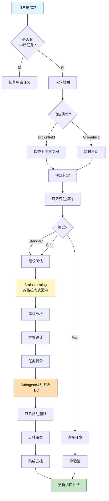

# DevFlow Kit

> **装好就用的 AI 编程工作流系统** - 整合结构化流程、工程纪律与跨会话记忆

[](LICENSE)
[](CHANGELOG.md)

---

## 🚀 5分钟快速上手

### 安装（AI自动完成，无需手动执行脚本）

在你的AI编程工具中说：

```
Use install-devflow.
```

AI会自动：
1. **扫描项目** - 识别技术栈、框架、目录结构
2. **提取信息** - 自动填充 PROJECT_CONTEXT.md
3. **询问模式** - 选择基础/完整/预览
4. **复制文件** - 安装所有必要组件
5. **验证完整性** - 确保一切正常
6. **引导开始** - 提供使用示例

**就这么简单！AI自动分析你的项目，无需手动填写任何信息。**

### 使用

在你的AI编程工具(Cursor/Claude Code/Gemini等)中说:

```
Use devflow-kit.

我要做一个用户登录功能,支持邮箱密码和JWT认证
```

AI会自动:
1. 读取 `flow/GO.md` 路由器
2. 判定模式(Standard/Strict)
3. 启动需求澄清 → 设计 → TDD开发 → 测试 → 审查流程
4. 生成所有产物到 `.specs/<req-id>/`

**就这么简单!**

---

## ✨ 核心特性

### 1. 智能流程编排 (来自 devflow-kit)

- **三档模式**: Fast(小改动) / Standard(常规功能) / Strict(高风险)
- **风险评估矩阵**: 自动根据技术复杂度、业务影响、数据敏感性评分
- **Stage Skill架构**: 17个阶段技能,按需加载,依赖管理
- **前置产物全量读取**: 智能降级策略,容错性强

### 2. 工程纪律保障 (来自 superpowers)

- **Brainstorming**: 苏格拉底式需求澄清,避免盲目编码
- **TDD硬约束**: RED-GREEN-REFACTOR循环,先写失败测试
- **Subagent驱动**: 并行子代理执行,两阶段审查(spec合规+代码质量)
- **系统化调试**: 四阶段根因追溯,防御性编程

### 3. 跨会话记忆 (来自 team-skills, 可选)

**自动记忆**:
- ✅ 会话开始时自动读取项目背景
- ✅ 需求完成后自动更新记忆
- ✅ AI自动记录重要决策和失败模式

**手动管理**:
```
Use manage-memory. 初始化记忆系统
Use devflow-learning workflow
```

- **持久化上下文**: `.superpowers-memory/` 存储项目知识
- **决策追踪**: ADR风格记录重要技术决策
- **失败模式库**: 避免重复踩坑
- **会话日志**: 形成完整工作历史轨迹

### 4. 工具无关部署

**原生适配器**(4套):
- ✅ Cursor (`adapters/cursor/rules/`)
- ✅ Claude Code (`adapters/claude/commands/`)
- ✅ Gemini CLI (`adapters/gemini/commands/`)
- ✅ Windsurf (`adapters/windsurf/workflows/`)

**通用支持**(通过 AGENTS.md + flow/GO.md):
- ✅ GitHub Copilot
- ✅ 通义灵码
- ✅ CodeWhisperer
- ✅ 任何能读取 Markdown 文件的 AI 工具

---

## 📊 工作流程可视化



---

## 📦 包内有什么

### 核心目录

| 目录 | 用途 | 来源 |
|------|------|------|
| `flow/` | 流程编排(GO.md/RULES.md/stage-skills/) | devflow-kit |
| `skills/` | Superpowers核心技能(14个) | superpowers |
| `agent-skills/` | 专业工程技能库(20个) | devflow-kit |
| `memory/` | 记忆系统模板和脚本 | team-skills |
| `openspec/` | OpenSpec规范集成(企业级变更管理,可选) | team-skills |
| `adapters/` | 工具适配器(Claude/Cursor/Gemini等) | devflow-kit |
| `scripts/` | 安装和维护脚本 | 合并优化 |
| `docs/` | 文档和教程 | 重写整合 |

### Stage Skills (15个)

| 阶段 | Stage Skill | 依赖的Skills |
|------|-------------|----------------|
| **0-confirm** | stage-0-confirm | idea-refine, development-core |
| **1-analysis** | stage-1-analysis | development-core |
| **2-design** | stage-2-design | design-and-architecture, brainstorming |
| **2a-ui-design** | stage-2a-ui-design | frontend-ui-engineering |
| **3-task** | stage-3-task | planning-and-context |
| **3a-plan** | stage-3a-plan | writing-plans |
| **4-dev** | stage-4-dev | development-core, testing-suite<br/>+ TDD, subagent-driven |
| **5-test** | stage-5-test | security-and-performance |
| **6-review** | stage-6-review | requesting-code-review, code-quality |
| **7-integration** | stage-7-integration | finishing-a-development-branch |
| **A-architect** | stage-a-architect | design-and-architecture |
| **A-evolve** | stage-a-evolve | design-and-architecture |
| **I-intel-scan** | stage-i-intel-scan | development-core |
| **M-health** | stage-m-health | code-quality |
| **Orchestrator** | stage-orchestrator | - |

> **注**: 依赖分为两类:
> - **Agent Skills**: 基础工程能力(来自 `agent-skills/skills/`)
> - **Superpowers Skills**: 工程纪律方法论(来自 `skills/`,如TDD、subagent-driven等)

---

## 🎯 使用场景

### 场景1: 开发新功能

```
Use devflow-kit.

在账号设置页增加已保存支付方式管理,支持信用卡和PayPal
```

AI会走完整流程: 需求澄清 → 设计 → TDD开发 → 测试 → 审查

### 场景2: 快速修复Bug

```
Use devflow-kit. Fast模式: 修复settings页面按钮文案typo
```

AI直接修改 → 验证 → 完成,不跑全套流程

### 场景3: 高风险改动

```
Use devflow-kit. Strict模式: 把用户session从Redis迁移到带namespace的Redis cluster
```

AI强制执行: 安全审查 + 迁移方案 + 回滚计划 + 独立review

### 场景4: 继续上次工作

```
Use devflow-kit. 继续
```

AI读取 `.specs/项目状态.md` 和记忆系统,恢复断点

### 场景5: 管理记忆系统

```
Use manage-memory.

初始化记忆系统
```

或

```
Use devflow-learning workflow
```

AI会自动更新项目记忆，记录重要决策和失败模式

### 场景6: Code Review

```
Use devflow-kit. review 上面这段代码,重点关注安全和边界处理
```

AI走五轴审查: spec合规/代码质量/安全/性能/UI

---

## 🔧 安装选项

> **OpenSpec 是什么?**
> OpenSpec 是一种结构化的变更管理方法,通过提案(proposal)、设计(design)、规格(specs)、任务(tasks)四步文档化每个功能变更。适合大型团队和企业级项目。
> 
> **渐进式采用路径**:
> - Level 1: 不使用 OpenSpec,仅用 SuperFlow 基础流程
> - Level 2: 添加记忆系统,仍不使用 OpenSpec
> - Level 3: 启用 OpenSpec,实现完整的变更追踪和归档

### 选项A: 仅工作流(推荐首次尝试)

```bash
# Windows
cd superflow-kit
.\scripts\init-project.ps1 -ProjectRoot D:\my-project -IncludeWorkflows

# macOS/Linux
sh ./scripts/init-project.sh --project-root /path/to/my-project --include-workflows
```

创建:
```
my-project/
├── .ai-workflows/          # 工作流定义
└── AGENTS.md               # AI助手指令
```

### 选项B: 完整安装(含记忆系统)

```bash
# Windows
.\scripts\init-project.ps1 -ProjectRoot D:\my-project -IncludeWorkflows -IncludeMemory

# macOS/Linux
sh ./scripts/init-project.sh --project-root /path/to/my-project --include-workflows --include-memory
```

额外创建:
```
my-project/
└── .superpowers-memory/    # 记忆系统
    ├── PROJECT_CONTEXT.md
    ├── CURRENT_STATE.md
    └── session-journal/
```

### 选项C: 预览模式

```bash
# 查看将创建的文件,不实际修改
.\scripts\init-project.ps1 -ProjectRoot D:\my-project -DryRun
```

---

## 📚 学习路径

### 新手入门

1. **[QUICKSTART.md](docs/QUICKSTART.md)** - 5分钟快速上手
2. **[教程01: 你的第一个需求](docs/tutorials/01-first-req.md)** - 实战演练
3. **[教程02: 理解阶段流程](docs/tutorials/02-understand-phases.md)** - 深入学习
4. **[教程03: 模式选择](docs/tutorials/03-fast-vs-standard.md)** - 掌握三种模式

### 进阶提升

- **[记忆系统指南](docs/MEMORY_GUIDE.md)** - 跨会话上下文保持
- **[教程04: 常见问题调试](docs/tutorials/04-debug-common-issues.md)** - 问题排查
- **[教程06: 高级技巧](docs/tutorials/06-advanced-tips.md)** - 自定义扩展

### 团队部署

- **[实施指南](docs/IMPLEMENTATION_GUIDE.md)** - 分层次方案(待补充)
- **[升级路线图](docs/UPGRADE_ROADMAP.md)** - 3个月规划(待补充)

---

## 🏗️ 架构设计

### 三层架构

```
┌─────────────────────────────────────┐
│   路由层 (Routing Layer)            │
│   - GO.md 统一路由器                │
│   - 模式判定引擎                    │
│   - 入场检测                        │
└──────────────┬──────────────────────┘
               │
┌──────────────▼──────────────────────┐
│   执行层 (Execution Layer)          │
│   - Stage Skills (15个阶段)         │
│   - Superpowers Skills (14个)       │
│   - Agent Skills (20个)             │
└──────────────┬──────────────────────┘
               │
┌──────────────▼──────────────────────┐
│   持久层 (Persistence Layer)        │
│   - .superpowers-memory/            │
│   - .specs/<req-id>/                │
│   - OpenSpec changes (可选)         │
└─────────────────────────────────────┘
```

### 关键创新

1. **Stage Skill + Superpowers Skills混合调度**
   - Stage Skill负责阶段门控和流程编排
   - Superpowers Skills提供工程纪律和方法论
   - 通过dependencies声明自动加载

2. **风险评估矩阵**
   - 4维度评分: 技术复杂度/业务影响/数据敏感性/回滚难度
   - 自动推荐Fast/Standard/Strict模式
   - 置信度计算和特殊规则(一票否决)

3. **记忆系统集成点**
   - 每个Stage Skill的关键节点插入记忆读写
   - 会话结束时自动触发closeout检查
   - 验证脚本确保记忆质量

---

## 🤝 贡献指南

我们欢迎贡献!请遵循以下流程:

1. Fork本仓库
2. 创建特性分支 (`git checkout -b feature/amazing-feature`)
3. 提交更改 (`git commit -m 'Add amazing feature'`)
4. 推送到分支 (`git push origin feature/amazing-feature`)
5. 开启Pull Request

详见 [CONTRIBUTING.md](CONTRIBUTING.md)(待补充)

---

## 📄 许可证

MIT License - 详见 [LICENSE](LICENSE) 文件

---

## 🙏 致谢

DevFlow Kit整合了三个优秀项目的精华:

- **[devflow-kit](https://github.com/your-org/devflow-kit)** - 结构化流程编排
- **[superpowers](https://github.com/obra/superpowers)** - 工程纪律和方法论
- **[superpowers-openspec-team-skills](https://github.com/your-org/superpowers-openspec-team-skills)** - 记忆系统和OpenSpec集成

感谢这些项目的作者和社区贡献者!

---

## 📮 联系方式

- **Issues**: [GitHub Issues](https://github.com/your-org/devflow-kit/issues)
- **Discussions**: [GitHub Discussions](https://github.com/your-org/devflow-kit/discussions)
- **Email**: your-email@example.com

---

## 🌟 Star History

如果这个项目对你有帮助,请给我们一个Star ⭐

---

**开始构建更好的软件吧!** 🚀
