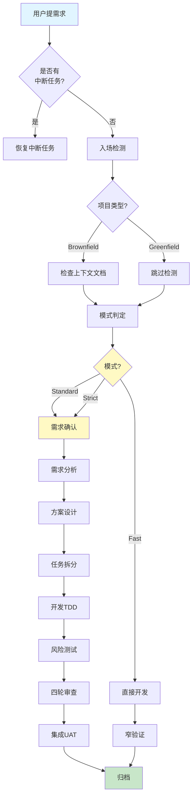

# devflow-kit

一个装好就用的 AI 编程 skill 包。它把 **流程编排**（需求 → 设计 → 任务 → 开发 → 测试 → 审查 → 发布）和 **专业工程 skill**（12 个高质量模块）整合成一个统一入口，对外只暴露一个主 skill：`devflow-kit`。

> **🆕 v2.1 新特性**: Skill重构(22→12) + 智能推荐引擎 + 完整教程体系 [查看升级说明](docs/CHANGELOG_v2.0.md)

> **新用户？** 直接看 [QUICKSTART.md](QUICKSTART.md) ——5分钟上手，不用读文档。

---

## 📊 完整流程可视化



**前端项目路径**: `需求确认 → ANALYSIS → DESIGN → 2a UI-DESIGN → TASK → DEV → TEST → REVIEW (3轮) → INTEGRATION`  
**后端项目路径**: `需求确认 → ANALYSIS → DESIGN → TASK → DEV → TEST → REVIEW → INTEGRATION`  
**MVP 路径**: `ANALYSIS → TASK → DEV`（只跑这三步，3个文件起步）

---

## 前置条件

需要以下**任一** AI 编程工具：
- **Cursor** / **Windsurf** / **Claude Code** / **Gemini CLI**（推荐）
- 其他支持 `@` 引用文件或粘贴系统提示的工具

这个 skill 不依赖特定 IDE 或运行时，纯 Markdown 驱动。

---

## 安装

### 方式 A：AI 工具已安装此 skill（WorkBuddy / Claude Code 插件等）

如果已在 skill 列表中看到 `devflow-kit`，直接在对话中说"Use devflow-kit"即可（见下方"30 秒快速上手"）。

### 方式 B：手动复制到项目

```bash
# 把 devflow-kit 复制到你的项目根目录
cp -r /path/to/devflow-kit your-project/
# 之后在 AI 对话中使用 @devflow-kit/flow/GO.md 触发
```

### 方式 C：各工具适配器安装

详见下方[「各工具适配器」](#各工具适配器)章节。每个工具安装一次即可。

---

## 30 秒快速上手

只需把你的需求告诉 AI。根据你的工具选择对应方式：

### 方式 A：Claude Code / Gemini CLI（内置 skill 系统）

```text
Use devflow-kit.

我要做：<你的需求>
```

### 方式 B：Cursor / Windsurf（支持 `@` 引用文件 · 推荐）

```text
@devflow-kit/flow/GO.md

<你的需求>
```

> 如果以上都不适用（VS Code、JetBrains、Copilot 等），见下方「任何其他工具」适配方式。

就这两条。AI 会自动判断用哪个阶段、要不要追问澄清、走多重的流程。

---

## 📚 学习路径

**新手入门**: 
1. [QUICKSTART.md](QUICKSTART.md) - 5分钟快速上手
2. [教程 01: 你的第一个需求](docs/tutorials/01-first-req.md) - 实战演练
3. [教程 02: 理解阶段流程](docs/tutorials/02-understand-phases.md) - 深入学习

**进阶提升**:
- [教程目录](docs/tutorials/README.md) - 完整教程列表
- [v2.0 升级说明](docs/CHANGELOG_v2.0.md) - 新特性介绍
- [记忆系统集成](docs/MEMORY_INTEGRATION.md) - 跨会话上下文

**团队部署**:
- [实施指南](docs/IMPLEMENTATION_GUIDE.md) - 分层次方案
- [升级路线图](docs/UPGRADE_ROADMAP.md) - 3个月规划

---

## 你会听到的词（名词解释）

| 词 | 是什么意思 | 你需要管吗？ |
|---|---|---|
| **req-id** | 每个需求/改动自动生成一个短名（如 `add-search-box`），产物按这个名存档 | 不用管，AI 自动生成 |
| **`.specs/`** | 产物存放目录，在项目根目录下自动创建 | 不用管，AI 自动创建 |
| **00-需求确认.md** | 第一轮：把你的模糊想法整理成一句话提案 | 你会看到，不用自己写 |
| **01-需求分析.md** | 第二轮：明确"要做什么、怎么验收" | 你会看到，可以纠偏 |
| **02-方案设计.md** | 第三轮：决定"用什么技术、怎么实现" | 你会看到，可以纠偏 |
| **02a-UI设计.md** |（可选）前端 UI 设计稿 | 你会看到，可以纠偏 |
| **03-任务拆分.md** | 第四轮：把设计拆成小任务，逐个完成 | AI 自动拆，你选确认 |
| **04-开发记录.md** | 第五轮：开发阶段汇总报告 | AI 自动生成 |
| **05-测试报告.md** | 第六轮：风险驱动测试报告（功能必测，性能/安全/兼容/可观测按风险触发） | 你会看到，可以纠偏 |
| **06-代码审查.md** | 第七轮：代码审查报告，含问题清单 | 你会看到，仅严重项需确认 |
| **07-发布清单.md** | 第八轮：发布检查清单+回滚方案 | 你会看到，需逐项确认 |
| **Fast 模式** | 小改动（<50行）直接改，不跑全套流程 | 说"快速模式"即可 |
| **Standard 模式** | 常规功能开发，走完整阶段链 | 默认模式，不用特别说 |
| **Strict 模式** | 高风险改动（支付/鉴权/数据库）多加确认点 | AI 自动升级，也可主动说 |
| **产物** | 各阶段生成的 .md 文件（需求/设计/任务/开发/测试/审查/发布） | 存在 `.specs/<req-id>/`，随时可看 |

---

## 完整流程长什么样

```
你提需求
  ↓
[需求确认] 澄清意图，生成 req-id
  ↓
[分析] 写用户故事 + 验收准则
  ↓
[设计] 选技术栈 + 写架构决策
  ↓
[任务] 拆成可并行的小任务
  ↓
[开发] 逐任务实现（TDD）
  ↓
[测试] 风险驱动验证：功能必测，性能/安全/兼容/可观测按风险触发
  ↓
[审查] 五轴 review（spec/代码/安全/性能/UI）
  ↓
[集成] 归档产物，清理临时文件
```

> 小改动不必走全套。AI 会自动判断用 Fast / Standard / Strict。

---

## 产物在哪？怎么看？

产物存在项目根目录的 `.specs/` 下：

```
你的项目/
├── .specs/
│   ├── 项目状态.md            ← 当前进度（AI 自动维护）
│   ├── 上下文.md              ← 项目背景（AI 自动积累）
│   ├── 经验总结.md            ← 跨任务是失败教训库
│   ├── 需求基线.md            ← 项目级需求基线（Delta 模式）
│   ├── 设计基线.md            ← 项目级设计基线（Delta 模式）
│   └── <req-id>/             ← 本次改动的所有产物
│       ├── 00-需求确认.md
│       ├── 01-需求分析.md
│       ├── 02-方案设计.md
│       ├── 02a-UI设计.md      (仅前端项目)
│       ├── 03-任务拆分.md
│       ├── 04-开发记录.md
│       ├── 05-测试报告.md
│       ├── 06-代码审查.md
│       └── 07-发布清单.md
└── src/...                    ← 你的代码
```

用任何 Markdown 编辑器都能打开这些文件。VS Code / Cursor / Windsurf 直接预览。

---

## Delta 模式（存量项目迭代）

如果你的项目已有需求基线（`.specs/需求基线.md`）或设计基线（`.specs/设计基线.md`），AI 会自动进入 **Delta 模式**：

- 只写**变更部分**（ADDED / MODIFIED / REMOVED）
- 不重复已有内容，节省 token
- 归档时自动合并到基线

适合存量项目的持续迭代，避免每次都写完整需求/设计文档。

---

## 三种模式（AI 自动判断，你也可以主动指定）

| 模式 | 适合什么 | 一句话 |
|---|---|---|
| **Fast** | 改 1~2 文件、<50 行、低风险 | 直接改→窄验证 |
| **Standard** | 普通功能、多文件改动、UI | 完整 7 阶段流程 |
| **Strict** | 鉴权、支付、PII、数据库 | 完整流程+安全+回滚+独立 review |

你可以主动说"Fast 模式"或"Strict 模式"，不说的话 AI 按风险自动升级。

---

## 使用场景与示例

> **统一用法**：`Use devflow-kit.` + 你的需求。Cursor/Windsurf 用户可改用 `@devflow-kit/flow/GO.md`。

### 场景 1：小改动 / Bugfix

改一个 typo、修一个逻辑 bug、补一个缺失的空判断：

```text
Use devflow-kit. Fast 模式：修复 settings 页面按钮文案里的 typo。
```

```text
Use devflow-kit. 修复用户点击"保存"后有时不跳转的 bug。
```

AI 会：直接定位问题 → 修改 → 运行最窄的验证 → 总结证据。不会强制走整套流程。

---

### 场景 2：开发新功能

做一个完整的功能，比如新页面、新 API 端点、新模块：

```text
Use devflow-kit. 在账号设置页增加已保存支付方式管理。
```

```text
Use devflow-kit. 做一个支持搜索和分页的商品列表页面。
```

AI 会：反问澄清 → 写需求确认书 → 整理需求和验收准则 → 技术设计 → 拆任务 → 逐任务实现（TDD）→ 风险驱动测试 → Review。每个阶段的产物存到 `.specs/<req-id>/`。

---

### 场景 3：高风险改动

涉及用户数据、鉴权、数据库、支付等敏感内容：

```text
Use devflow-kit. Strict 模式：把用户 session 存储从 Redis DB 0 迁移到带 namespace 的 Redis cluster，要有回滚计划。
```

```text
Use devflow-kit. 给所有写接口加 CSRF 保护。
```

AI 会在关键决策前强制暂停确认，进行安全检查，并要求有测试和回滚方案才能继续。

---

### 场景 4：继续上次没做完的工作

```text
Use devflow-kit. 继续
```

```text
Use devflow-kit. 继续上次的支付模块。
```

AI 会读取 `项目状态.md` 和 `.specs/` 下已有产物，恢复上次断点继续推进。

---

### 场景 5：执行已规划的具体任务

```text
Use devflow-kit. 执行 T03
```

AI 直接读取任务详情并开始实现，不重跑前面的规划阶段。

---

### 场景 6：Code Review

```text
Use devflow-kit. review 上面这段代码
```

```text
Use devflow-kit. 对最近提交的改动做 review，重点关注安全和边界处理。
```

AI 会走五轴 Review（spec 合规、代码质量、安全、性能、UI 视觉），用严重度标签（Critical / Major / Minor / Nit）标注问题。

---

### 场景 7：接手老项目 / 首次扫描

```text
Use devflow-kit. 帮我了解这个项目的整体结构，并生成项目上下文文档。
```

AI 会扫描项目，自动生成 `上下文.md`（技术栈、命名约定、已有抽象索引、禁动清单），后续每次对话都能利用这份上下文减少幻觉。

---

### 场景 8：架构决策 / 技术选型

```text
Use devflow-kit. 我要在 Redis 和 Postgres 之间选一个做消息队列，帮我做技术设计。
```

```text
Use devflow-kit. 梳理一下当前项目的模块结构，建立架构文档。
```

---

### 场景 9：UI / 前端开发

```text
Use devflow-kit. 设计一个极简风格的仪表盘页面，定义 design tokens。
```

```text
Use devflow-kit. 对当前首页做视觉 audit，找出 AI 生成 UI 的常见问题。
```

AI 会走前端 skill（UI 美学决策、design tokens、WCAG 无障碍、反 AI-slop 检查清单）。

---

### 场景 10：代码库健康检查

```text
Use devflow-kit. 对这个项目做一次技术债扫描，找出高优先级的问题。
```

```text
Use devflow-kit. 扫描死代码和重复代码，给出清理建议。
```

---

### 场景 11：上传需求文档 / PRD

已有需求文档，不想从头反问：

```text
Use devflow-kit. 这是需求文档：
[粘贴或上传 PRD 内容]
```

AI 会：解析文档 → 评估完整度 → 提取 AC → 只问不清楚的点 → 生成产物。高质量文档可直接跳过反问阶段。

---

### 场景 12：上传设计稿

已有 UI 设计稿：

```text
Use devflow-kit. 这是 Figma 链接：https://figma.com/...
```

```text
Use devflow-kit. 设计稿见附件截图。
```

AI 会：解析设计稿 → 提取组件/交互 → 确认细节 → 进入 UI 设计阶段。

---

### 场景 13：上传技术方案

已有技术设计文档：

```text
Use devflow-kit. 这是技术方案：
[粘贴或上传技术设计文档]
```

AI 会：解析方案 → 对齐架构 → 直接进入设计或任务拆分阶段。

---

## 单独使用某个阶段（不走完整流程）

你不必每次都从头走完整流程。各阶段 prompt 可以独立调用：

| 只想做这件事 | 引用这个文件 |
|---|---|
| 把模糊想法澄清清楚 | `@devflow-kit/flow/prompts/0-confirm.md` |
| 写一份需求文档 / PRD | `@devflow-kit/flow/prompts/1-analysis.md` |
| 做技术设计 + ADR | `@devflow-kit/flow/prompts/2-design.md` |
| 前端 UI 设计方向决策 | `@devflow-kit/flow/prompts/2a-ui-design.md` |
| 把需求拆成可执行任务 | `@devflow-kit/flow/prompts/3-task.md` |
| 执行单个任务（TDD）| `@devflow-kit/flow/prompts/4-dev.md` |
| 测试规划 + UAT | `@devflow-kit/flow/prompts/5-test.md` |
| Code Review | `@devflow-kit/flow/prompts/6-review.md` |
| 上线 / 归档 / 集成验收 | `@devflow-kit/flow/prompts/7-integration.md` |
| 接手老项目扫描 | `@devflow-kit/flow/prompts/I-intel-scan.md` |
| 架构文档梳理 | `@devflow-kit/flow/prompts/A-architect.md` |
| 代码库健康检查 | `@devflow-kit/flow/prompts/M-health.md` |
| 换 UI 视觉风格 | `@devflow-kit/flow/prompts/L-restyle.md` |

---

## 各工具适配器

### Claude Code（推荐）

安装后可直接用斜杠命令：

```
/go 做一个账号设置页      # 统一入口，自动路由到正确阶段
/spec 梳理需求           # 需求确认/分析阶段
/plan 拆任务             # 任务拆分阶段
/build 实现任务          # 开发阶段
/test 测试验证           # 测试阶段
/review 代码审查         # 审查阶段
/ship 发布上线           # 集成/发布阶段
```

每个命令都会走完整的流程检查（项目状态、入场检测、阶段门验证）。

### Windsurf

把 workflow 复制进去（一次性）：

```powershell
mkdir -Force .windsurf\workflows
copy devflow-kit\adapters\windsurf\workflows\*.md .windsurf\workflows\
```

之后用 `/go` 触发。

### Cursor

把规则文件复制进去：

```bash
cp devflow-kit/adapters/cursor/rules/devflow-kit.md .cursor/rules/
```

之后在 chat 里直接用 `@devflow-kit/flow/GO.md` 或按 Cursor 规则自动触发。

### Gemini CLI

```bash
# 用斜杠命令适配器
cp devflow-kit/adapters/gemini/commands/*.toml ~/.gemini/commands/
```

### GitHub Copilot

把 `flow/RULES.md` 或 `flow/SYSTEM.md` 内容粘贴到项目根 `.github/copilot-instructions.md`。

或者在 chat 中手动引用：

```text
@devflow-kit/flow/GO.md

帮我做个搜索功能
```

### VS Code / JetBrains / 其他工具

所有 prompt 都是纯 Markdown。粘贴以下内容到 AI 对话中即可：

```text
@devflow-kit/flow/GO.md

<你的需求>
```

---

## 包内有什么

详细文件清单见 `SKILL.md#包结构`。核心目录：

| 目录/文件 | 用途 |
|---|---|
| `SKILL.md` | AI 入口，一切从这里开始 |
| `flow/` | 流程编排（GO.md/SYSTEM.md/RULES.md/prompts/templates） |
| `agent-skills/` | 上游 agent-skills 项目快照：20 个专业工程 skill + 3 个专家审查角色 + 参考资料 |
| `adapters/` | Claude/Cursor/Gemini/Windsurf 等工具适配器 |

---

## 使用 RULES.md 或 SYSTEM.md 单独提升 AI 纪律

如果你只想让 AI 更靠谱、更少幻觉、不跳步骤，可以只把 `flow/RULES.md` 或 `flow/SYSTEM.md` 注入系统提示或全局规则，不用走完整流程：

| 文件 | 用途 |
|---|---|
| `flow/SYSTEM.md` | **精简注入版**（推荐）— METHODOLOGY + RULES 的精简合并版，适合永久注入 |
| `flow/RULES.md` | **完整规则版** — 13 类规则（R1-R13），适合需要完整约束的场景 |

| 工具 | 做法 |
|---|---|
| Cursor | 内容复制到 `.cursorrules` |
| Windsurf | 内容复制到 `.windsurfrules` |
| Claude Code | 内容复制到项目根 `CLAUDE.md` 或全局 `~/.claude/CLAUDE.md` |
| 任何工具 | 粘贴进系统提示 |

---

## 自检（安装后验证）

```bash
bash devflow-kit/scripts/selftest.sh devflow-kit
```

检查 frontmatter、必需目录、关键 flow prompts、专业 skill、适配器、JSON 元数据是否齐全。

---

## 常见问题

**Q：每次都要走完整流程吗？**
不。小改动走 Fast 模式，只做"改 → 验证"两步。只有 Standard / Strict 才走完整阶段链。

**Q：流程产物放在哪？**
默认存到项目根目录下的 `.specs/<req-id>/`，每个阶段一个 `.md` 文件。跨会话通过 `项目状态.md` 恢复状态。

**Q：如果只想做 Code Review 不想走流程怎么办？**
直接：`@devflow-kit/flow/prompts/6-review.md` + 你要审查的代码。

**Q：我的项目已经有代码了，怎么安全接入？**
先用 `I-intel-scan` 扫描项目生成 `上下文.md`，让 AI 理解现有架构再开始做需求。详见[老项目接入护栏](#老项目安全护栏)。

**Q：怎么安装这个 skill？**
见上方[「安装」](#安装)章节。支持 WorkBuddy 直接使用、手动复制到项目、或各工具适配器三种方式。

**Q：支持 VS Code 吗？**
支持。在 VS Code + GitHub Copilot Chat / Cline / Continue.dev 里，直接粘贴 `@devflow-kit/flow/GO.md` + 你的需求即可。详见「各工具适配器」的通用方式。

**Q：AI 生成的产物文件太多，我想少点**
告诉 AI "极简模式"或"只要设计和任务"，AI 会裁剪产物。

---

## 老项目安全护栏

如果你的项目已经有代码，直接让 AI 开写容易"不按架构来"或"顺手改了不该改的文件"。devflow-kit 内置 5 条护栏：

| 护栏 | 防止的事故 |
|---|---|
| 入场扫描生成 `上下文.md` | AI 写出格格不入的代码（不知道你用 Repository 模式、zustand 等） |
| 设计阶段强制对齐既有架构 | 引入与项目风格冲突的新模式 |
| 任务声明读/写边界 | "顺手改了别的文件"污染 PR |
| 破坏性变更高门槛协议 | 删错代码 / 改坏公共接口 |
| 实现前 grep 已有抽象 | 重复实现项目里已有的工具函数 |

老项目首次使用推荐路径：

```text
@devflow-kit/flow/GO.md

帮我加一个 X 功能
```

AI 检测到没有 `上下文.md` 后会先问你是否扫描项目，扫描完再进入分析阶段。

---

## 许可

[MIT](LICENSE)。
