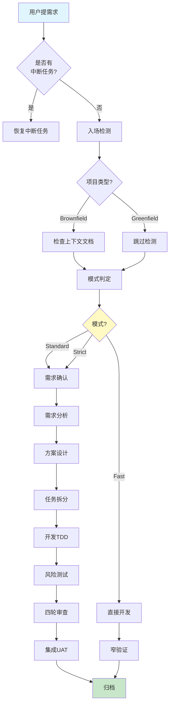

# devflow-kit v2.0 升级路线图

> **目标**: 在保持核心流程不变的前提下，解决已知问题，提升易用性和可维护性  
> **时间规划**: 3个月分阶段实施  
> **兼容性**: 向后兼容v1.x项目

---

## 📋 总览

```
Phase 1 (Month 1): 基础优化 - 解决P0/P1问题
├─ 1.1 集成记忆系统
├─ 1.2 明确Fast模式边界
└─ 1.3 产物归档机制

Phase 2 (Month 2): 体验优化 - 解决P2/P3问题  
├─ 2.1 简化新手引导
├─ 2.2 可视化流程图
└─ 2.3 智能模式推荐

Phase 3 (Month 3): 架构优化 - 解决P4问题
├─ 3.1 Skill合并与重构
├─ 3.2 插件化架构
└─ 3.3 Web管理界面(可选)
```

---

## Phase 1: 基础优化 (Week 1-4)

### 1.1 集成记忆系统 ✅

**优先级**: P0  
**工作量**: 2周  
**负责人**: AI助手 + 核心团队

#### 交付物

- [x] `docs/MEMORY_INTEGRATION.md` - 记忆系统集成规范
- [ ] `.specs/.memory/` 目录结构
- [ ] `scripts/install-memory.ps1` - Windows初始化脚本
- [ ] `scripts/install-memory.sh` - macOS/Linux初始化脚本
- [ ] `GO.md` 修改 - 集成记忆读写逻辑
- [ ] `flow/templates/` 新增记忆模板

#### 实施步骤

**Week 1: 设计与原型**
1. 完成 MEMORY_INTEGRATION.md 文档
2. 设计记忆文件模板
3. 在测试项目中手动验证流程

**Week 2: 开发与测试**
1. 编写初始化脚本
2. 修改 GO.md 集成记忆读写
3. 在3个真实项目中试点
4. 收集反馈并调整

#### 验收标准

- ✅ 新项目可通过脚本一键初始化记忆系统
- ✅ AI在会话开始时自动读取 PROJECT_CONTEXT.md 和 CURRENT_STATE.md
- ✅ 完成req后自动更新 CURRENT_STATE.md
- ✅ 长会话自动生成 session journal
- ✅ 不破坏现有 .specs/ 结构

#### 风险与缓解

| 风险 | 概率 | 影响 | 缓解措施 |
|------|------|------|---------|
| 记忆文件过多污染Git | 中 | 中 | 提供.gitignore模板，默认忽略session-journal |
| AI误更新记忆 | 低 | 高 | 增加确认机制，关键更新需用户approve |
| 与上下文.md冲突 | 低 | 中 | 明确两者职责边界，文档说明 |

---

### 1.2 明确Fast模式边界

**优先级**: P1  
**工作量**: 3天  
**负责人**: AI助手

#### 问题分析

当前规则模糊:
```markdown
Fast模式: 1~2文件、<50行、低风险、需求清楚
```

**问题:**
- "低风险"无法量化
- AI可能误判导致质量问题
- 用户说Fast但实际复杂时无升级机制

#### 解决方案

**新增: Fast模式Checklist**

```markdown
## Fast模式准入检查（必须全部满足）

### 定量指标
- [ ] 改动文件数 ≤ 2
- [ ] 预估代码行数 < 50
- [ ] 不涉及数据库schema变更
- [ ] 不涉及API接口变更
- [ ] 不涉及鉴权/权限逻辑

### 定性指标
- [ ] 需求描述清晰无歧义
- [ ] 有明确的验收标准
- [ ] 不影响其他模块
- [ ] 有现成的测试框架可直接运行

### 高风险自动排除项（命中任一项→强制Standard）
- ❌ 修改核心业务逻辑（订单/支付/用户认证）
- ❌ 修改公共组件/工具函数
- ❌ 涉及第三方依赖升级
- ❌ 需要修改CI/CD配置
- ❌ 需要数据迁移
```

**新增: 模式升级协议**

```markdown
## 模式升级触发条件

AI在执行过程中发现以下情况时，必须暂停并建议升级：

1. **范围扩大**: 实际需要改动的文件数 > 2
2. **复杂度超预期**: 预估行数 > 50 或逻辑复杂
3. **发现隐藏风险**: 如涉及鉴权、数据一致性
4. **用户明确要求**: 用户说"这个比想象中复杂"

### 升级流程

```
⚠️ 模式升级建议

当前模式: Fast
建议升级到: Standard

原因:
1. 实际需要修改5个文件（超出Fast的2个文件限制）
2. 涉及用户认证逻辑（高风险领域）
3. 需要编写新的单元测试

请确认:
1. ✅ 升级到Standard（推荐）
2. 继续Fast模式（我了解风险）
3. 升级到Strict（特别谨慎）
```
```

#### 实施步骤

1. 修改 `flow/mode-rules.md` 添加checklist
2. 修改 `flow/GO.md` 第五步增加检查逻辑
3. 在路由声明中显示检查结果
4. 更新文档和示例

#### 验收标准

- ✅ AI能准确判断是否适合Fast模式
- ✅ 发现不符时主动建议升级
- ✅ 用户有最终决定权
- ✅ 升级流程顺畅不突兀

---

### 1.3 产物归档机制

**优先级**: P2  
**工作量**: 5天  
**负责人**: AI助手

#### 问题分析

长期项目`.specs/`目录膨胀:
```
.specs/
├── req-001/  (3个月前)
├── req-002/  (2个月前)
├── ...
├── req-156/  (昨天)
└── req-157/  (今天)
```

**问题:**
- Git历史膨胀
- 查找困难
- IDE索引慢

#### 解决方案

**归档策略:**

```markdown
## 自动归档规则

### 触发条件
- req完成且通过review（到达7-integration）
- 距离完成时间 > 30天
- 非活跃req（不在项目状态.md中标记为活跃）

### 归档动作
1. 移动 `.specs/<req-id>/` → `.specs/archive/YYYY-MM/<req-id>/`
2. 在 `.specs/ARCHIVE_INDEX.md` 中添加索引条目
3. 保留关键产物摘要（便于搜索）

### 归档后访问
- 通过 ARCHIVE_INDEX.md 检索
- 支持按日期/标签/关键词搜索
- 可随时恢复到 `.specs/` 重新查看
```

**ARCHIVE_INDEX.md 格式:**

```markdown
# Archive Index

## 2024-01

| Req-ID | 标题 | 完成日期 | 标签 | 关键产物 |
|--------|------|---------|------|---------|
| add-search-box | 商品搜索功能 | 2024-01-15 | feature, search | 02-方案设计.md, SearchBox.vue |
| fix-login-bug | 修复登录超时 | 2024-01-20 | bugfix, auth | 05-测试报告.md |

## 2024-02

[...类似结构...]

## 搜索索引

### 按标签
- #feature: add-search-box, user-profile, ...
- #bugfix: fix-login-bug, fix-cart-error, ...
- #auth: fix-login-bug, add-oauth, ...

### 按关键词
- 搜索: add-search-box
- 登录: fix-login-bug, add-oauth
- 支付: add-payment-gateway
```

#### 实施步骤

1. 创建 `scripts/archive-reqs.ps1/sh` 归档脚本
2. 修改 `flow/prompts/7-integration.md` 添加归档触发
3. 生成 ARCHIVE_INDEX.md 模板
4. 提供搜索辅助工具（可选）

#### 验收标准

- ✅ 30天前的req自动归档
- ✅ 归档后仍可检索
- ✅ Git历史不再膨胀
- ✅ 恢复归档的req简单快捷

---

## Phase 2: 体验优化 (Week 5-8)

### 2.1 简化新手引导

**优先级**: P3  
**工作量**: 1周

#### 当前问题

- GO.md 653行，新手难以理解
- 需要阅读多个文档才能上手
- 第一次使用容易出错

#### 解决方案

**新增: QUICKSTART.md**

```markdown
# devflow-kit 快速开始（5分钟上手）

## 第一步：安装（30秒）

```bash
# 复制devflow-kit到你的项目
cp -r /path/to/devflow-kit your-project/
cd your-project
```

## 第二步：首次使用（2分钟）

在AI对话中输入：

```
Use devflow-kit.

我想做一个用户登录功能。
```

AI会自动：
1. ✅ 反问澄清需求
2. ✅ 生成需求确认书
3. ✅ 引导你进入下一阶段

## 第三步：理解流程（3分钟）

```
你的想法 → 需求确认 → 分析 → 设计 → 任务 → 开发 → 测试 → 审查 → 完成
   ↓                                                            ↑
   └────────────── 每次只关注当前阶段，不用一次理解全部 ──────────┘
```

## 常见场景

### 场景1：小bug修复
```
Use devflow-kit. Fast模式：修复按钮点击无响应的问题。
```

### 场景2：新功能开发
```
Use devflow-kit. 我想加一个商品搜索功能。
```

### 场景3：继续之前的工作
```
Use devflow-kit. 继续
```

## 下一步

- 📖 完整文档：README.md
- 🎯 流程详解：flow/METHODOLOGY.md
- 🔧 高级用法：docs/ADVANCED.md
```

**新增: 交互式教程**

在 `docs/` 下创建分步教程：
```
docs/tutorials/
├── 01-first-req.md       # 第一个需求
├── 02-understand-phases.md  # 理解阶段
├── 03-fast-vs-standard.md   # 模式选择
└── 04-debug-common-issues.md # 常见问题调试
```

#### 验收标准

- ✅ 新用户在5分钟内完成第一个req
- ✅ 无需阅读GO.md即可使用
- ✅ 常见错误有明确提示

---

### 2.2 可视化流程图

**优先级**: P3  
**工作量**: 3天

#### 交付物

在 README.md 顶部添加Mermaid流程图：



**新增: 阶段详情图**


#### 验收标准

- ✅ README首屏可见流程图
- ✅ 点击节点可跳转到对应文档
- ✅ 手机端也能正常显示

---

### 2.3 智能模式推荐

**优先级**: P3  
**工作量**: 1周

#### 当前问题

模式判定依赖规则，不够智能：
```markdown
Fast: <50行、1-2文件、低风险
```

**问题:**
- 规则僵化，无法适应复杂场景
- 无法学习团队历史偏好

#### 解决方案

**基于历史数据的推荐引擎**

```markdown
## 模式推荐算法

### 输入特征
1. **需求描述长度**: 短→Fast, 长→Standard
2. **关键词识别**: 
   - "修复/typo/文案" → Fast
   - "功能/页面/API" → Standard
   - "支付/鉴权/迁移" → Strict
3. **历史相似req**: 过去类似的req用了什么模式
4. **文件改动预测**: 基于需求描述预估改动范围

### 推荐输出

```
🎯 模式推荐：Standard（置信度85%）

理由:
1. 需求描述较长（120字），涉及多个模块
2. 关键词"功能"出现2次，通常是Standard
3. 历史相似req "add-cart" 使用了Standard
4. 预估改动文件数：3-5个

其他选项:
• Fast（置信度10%）: 仅当你确定改动很小时
• Strict（置信度5%）: 如涉及支付/鉴权

请确认或选择其他模式：
1. ✅ Standard（推荐）
2. Fast
3. Strict
```

### 学习机制

每次req完成后，记录：
- 初始推荐模式
- 用户最终选择模式
- 实际改动规模
- 是否发生模式升级

用于优化下次推荐。
```

#### 实施步骤

1. 在 `.specs/` 根添加 `MODE_HISTORY.md`
2. 修改 GO.md 第五步集成推荐逻辑
3. 实现简单的关键词匹配算法
4. 逐步引入历史数据分析

#### 验收标准

- ✅ 推荐准确率 > 80%
- ✅ 用户采纳率 > 70%
- ✅ 推荐解释清晰可信

---

## Phase 3: 架构优化 (Week 9-12)

### 3.1 Skill合并与重构

**优先级**: P4  
**工作量**: 2周

#### 当前问题

20个skill维护成本高：
```
agent-skills/skills/ (20个)
```

**问题:**
- skill之间有重叠
- 新增skill需修改GO.md路由表
- 团队自定义skill困难

#### 解决方案

**合并策略:**

```markdown
## Skill合并方案

### 合并前 (20个)
- api-and-interface-design
- browser-testing-with-devtools
- ci-cd-and-automation
- code-review-and-quality
- code-simplification
- context-engineering
- debugging-and-error-recovery
- deprecation-and-migration
- documentation-and-adrs
- doubt-driven-development
- frontend-ui-engineering
- git-workflow-and-versioning
- idea-refine
- incremental-implementation
- performance-optimization
- planning-and-task-breakdown
- security-and-hardening
- shipping-and-launch
- source-driven-development
- spec-driven-development
- test-driven-development
- using-agent-skills

### 合并后 (12个核心)
1. **requirements** (合并: idea-refine, spec-driven-development)
2. **analysis** (合并: context-engineering, doubt-driven-development)
3. **design** (合并: api-and-interface-design, source-driven-development, documentation-and-adrs)
4. **ui-design** (原: frontend-ui-engineering)
5. **planning** (合并: planning-and-task-breakdown, incremental-implementation)
6. **development** (合并: test-driven-development, git-workflow-and-versioning)
7. **testing** (合并: browser-testing-with-devtools, performance-optimization)
8. **review** (合并: code-review-and-quality, security-and-hardening)
9. **shipping** (合并: shipping-and-launch, ci-cd-and-automation)
10. **maintenance** (合并: deprecation-and-migration, code-simplification)
11. **debugging** (原: debugging-and-error-recovery)
12. **meta** (原: using-agent-skills)
```

**插件化架构:**

```markdown
## 插件系统

### 目录结构
```
agent-skills/
├── core/          # 12个核心skill（不可删除）
├── plugins/       # 可选插件
│   ├── graphql-support/
│   ├── microservices/
│   └── custom-team-rules/
└── SKILL_REGISTRY.md  # 注册表
```

### 插件开发
团队可创建自己的plugin：
```
plugins/my-team-rules/
├── _SKILL.md
├── rules.md
└── templates/
```

在 SKILL_REGISTRY.md 中注册：
```yaml
- name: my-team-rules
  path: plugins/my-team-rules/_SKILL.md
  triggers: ["team-specific"]
  optional: true
```
```

#### 验收标准

- ✅ skill数量从20减到12
- ✅ 支持团队自定义plugin
- ✅ 向后兼容，旧skill仍可用
- ✅ 文档清晰说明如何开发plugin

---

### 3.2 Web管理界面（可选）

**优先级**: P4（低优先级）  
**工作量**: 3周  
**条件**: 如果团队规模>10人则实施

#### 功能清单

- 📊 仪表盘：展示活跃req、完成统计
- 🔍 搜索：按标签/关键词搜索历史req
- 📁 归档管理：查看/恢复归档的req
- 📝 记忆管理：编辑 PROJECT_CONTEXT.md 等
- 👥 团队协作：多人同时查看项目状态

#### 技术栈建议

- 前端: Vue 3 + Element Plus
- 后端: Node.js Express（读取.md文件）
- 存储: 直接读写文件系统（无需数据库）

---

## 📊 成功指标

### Phase 1 指标

| 指标 | 基线 | 目标 | 测量方法 |
|------|------|------|---------|
| 记忆系统采用率 | 0% | 60% | 新项目初始化比例 |
| Fast模式误判率 | ~30% | <10% | 模式升级次数/总Fast次数 |
| .specs/目录大小 | 持续增长 | 稳定 | 30天后归档率 |

### Phase 2 指标

| 指标 | 基线 | 目标 | 测量方法 |
|------|------|------|---------|
| 新手上手时间 | 30分钟 | <5分钟 | 用户调研 |
| 文档阅读量 | 需读GO.md | 只需读QUICKSTART | 用户反馈 |
| 模式推荐准确率 | N/A | >80% | 推荐vs实际选择对比 |

### Phase 3 指标

| 指标 | 基线 | 目标 | 测量方法 |
|------|------|------|---------|
| skill维护工时 | 8h/月 | 4h/月 | 团队时间追踪 |
| 自定义plugin数 | 0 | 3+ | 插件注册表统计 |
| 用户满意度 | 3.5/5 | 4.5/5 | 季度调研 |

---

## 🚀 快速启动 checklist

立即可以开始的行动：

- [ ] 阅读 `docs/MEMORY_INTEGRATION.md`
- [ ] 在测试项目手动创建 `.specs/.memory/` 结构
- [ ] 填写 PROJECT_CONTEXT.md 和 CURRENT_STATE.md
- [ ] 试用一次完整的req流程，观察记忆更新
- [ ] 收集团队反馈，调整模板
- [ ] 编写 install-memory.ps1 脚本
- [ ] 修改 GO.md 集成记忆读写逻辑

---

## 📞 支持与反馈

- 问题报告: GitHub Issues
- 讨论: Discord/Slack频道
- 文档贡献: PR欢迎
- 月度回顾: 每月底评估进度

---

*最后更新: 2024-01-15*  
*版本: v2.0-roadmap-draft*
