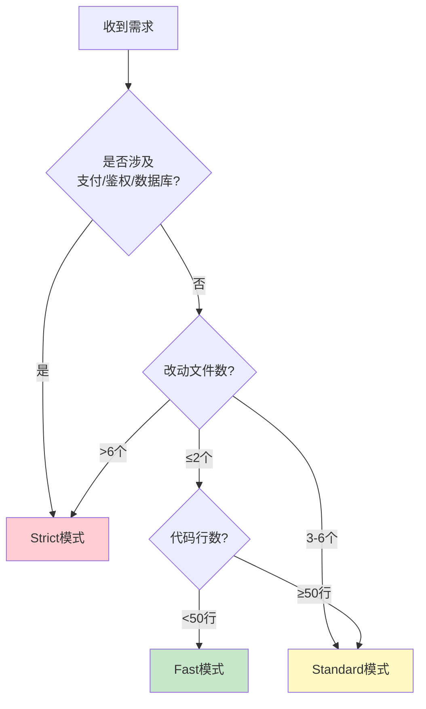

# 教程 03: 模式选择

> **学习目标**: 学会选择合适的模式（Fast/Standard/Strict）  
> **前置条件**: 已完成 [教程 01](01-first-req.md) 和 [教程 02](02-understand-phases.md)  
> **预计时间**: 10分钟

---

## 🎯 三种模式对比

| 维度 | Fast | Standard | Strict |
|------|------|----------|--------|
| **适用场景** | Bugfix、typo、小改动 | 新功能、多文件改动 | 高风险改动 |
| **文件数** | ≤2 | 3-6 | 7+ |
| **代码行数** | <50 | 50-300 | 300+ |
| **流程阶段** | 直接开发→验证 | 完整7阶段 | 7阶段+安全审查 |
| **产物数量** | 1个（开发记录） | 8个 | 10+个 |
| **耗时** | 5-15分钟 | 1-4小时 | 4-8小时 |
| **确认点** | 无 | 需求确认、设计确认 | 每个阶段都确认 |

---

## 📊 决策流程图



---

## 🔍 详细判定规则

### Fast模式准入Checklist

**硬性指标**（必须全部满足）:
- ✅ 改动文件数 ≤ 2
- ✅ 预估代码行数 < 50
- ✅ 不涉及数据库schema变更
- ✅ 不涉及API接口签名变更
- ✅ 不涉及鉴权/权限/支付逻辑

**软性指标**（至少满足3/5）:
- ✅ 需求描述清晰无歧义
- ✅ 有明确的验收标准
- ✅ 不影响其他模块（非公共组件）
- ✅ 有现成的测试框架可直接运行
- ✅ 非核心业务逻辑

**自动排除项**（命中任一项→强制Standard）:
- ❌ 修改订单/支付/用户认证核心逻辑
- ❌ 修改公共组件/工具函数（被多处引用）
- ❌ 涉及第三方依赖版本升级
- ❌ 需要修改CI/CD配置
- ❌ 需要数据迁移或回滚方案

---

### Standard模式适用场景

**典型场景**:
1. 新功能开发（搜索、列表、表单等）
2. 多文件改动（前端+后端）
3. UI/UX改进
4. 性能优化
5. 重构中等规模代码

**特征**:
- 需要需求澄清
- 需要技术设计
- 需要任务拆分
- 需要测试验证

---

### Strict模式触发条件

**高风险关键词**（命中任一→自动升级）:
- 支付、账单、订单
- 鉴权、权限、认证
- secret、password、token
- schema、migration、数据库结构
- 公共API、SDK
- 部署、CI/CD、infra
- 数据丢失、不可逆、删除

**典型场景**:
1. 支付系统集成
2. 用户认证改造
3. 数据库schema变更
4. 架构调整
5. 安全漏洞修复

---

## 💡 实战示例

### 示例1: 修复typo

**需求**: "修复登录按钮的typo，'登陆'改为'登录'"

**判定过程**:
```
✅ 改动文件数: 1个 (Header.vue)
✅ 预估行数: 1行
✅ 无schema/API/鉴权变更
✅ 需求清晰
✅ 不影响其他模块

结果: Fast模式
```

**执行**:
```
Use devflow-kit. Fast模式：修复登录按钮typo。
```

---

### 示例2: 开发搜索功能

**需求**: "在商品列表页添加搜索功能，支持按名称和分类搜索"

**判定过程**:
```
❌ 改动文件数: 预计5-7个
   - 前端: SearchBox.vue, search.ts, types.ts
   - 后端: SearchController.java, SearchService.java, SearchMapper.xml
   - 测试: search.spec.ts

❌ 预估行数: 200-300行

✅ 不涉及高风险关键词

结果: Standard模式
```

**执行**:
```
Use devflow-kit. 我想在商品列表页添加搜索功能。
```

AI会自动进入Standard模式，走完整7阶段流程。

---

### 示例3: 集成支付宝支付

**需求**: "集成支付宝支付，支持扫码支付和APP支付"

**判定过程**:
```
❌ 包含高风险关键词: "支付"
❌ 涉及敏感数据: payment secret
❌ 需要回滚方案
❌ 影响核心业务流程

结果: Strict模式（自动升级）
```

**执行**:
```
Use devflow-kit. 我要集成支付宝支付功能。
```

AI会自动升级到Strict模式，并输出：

```
⚠️ 检测到高风险关键词："支付"

已自动升级到 Strict 模式

Strict模式流程:
- 完整7阶段 + 安全审查 + 迁移方案 + 回滚方案
- 每个阶段都需要显式确认
- 独立的安全review

是否确认继续？[Y/n]
```

---

## 🔄 模式切换

### Fast → Standard

**触发条件**:
- AI发现实际改动超出预期
- 用户反对使用Fast模式

**输出**:
```
⚠️ Fast模式切换为Standard

触发原因: 发现涉及schema变更（新增feedbacks表）

新流程: Standard完整7阶段

是否同意切换？[Y/n]
```

---

### Standard → Strict

**触发条件**:
- 设计阶段发现高风险逻辑
- 涉及支付/鉴权等敏感操作

**输出**:
```
⚠️ Standard模式升级为Strict

触发原因: 设计方案中包含支付逻辑

新增要求:
- 安全审查报告
- 迁移方案
- 回滚方案
- 独立review

是否同意升级？[Y/n]
```

---

### 降级评估

**触发条件**（阶段切换时评估）:
- 实际改动文件数 ≤ 2
- 所有改动加起来 < 50行
- 无数据库/API/跨模块影响

**输出**:
```
📉 建议模式降级：Standard → Fast

触发信号: 实际改动仅2文件38行，纯后端无schema变更

裁剪内容: 跳过2-design/2a-ui-design，测试报告合并到开发记录

是否同意降级？[Y/n]
```

**注意**: AI不会自行降级，必须用户确认。

---

## 🎯 v2.0新特性：智能推荐

devflow-kit v2.0引入了智能模式推荐引擎，基于：

1. **文本特征**（30%权重）
   - 需求描述长度
   - 关键词识别

2. **历史相似性**（40%权重）
   - 查找相似的历史req
   - 统计其模式分布

3. **文件改动预测**（20%权重）
   - 基于需求描述预估文件数和行数

4. **风险因子**（10%权重）
   - 检测高风险关键词

**输出示例**:
```
🎯 模式推荐：Standard（置信度 82%）

评分详情:
- Fast: 15%
- Standard: 82% ← 推荐
- Strict: 3%

推荐理由:
1. 需求描述中等长度（65字），涉及多模块
2. 历史相似req "add-product-filter" 使用 Standard（相似度0.85）
3. 预估改动文件数：4-6个
4. 无高风险关键词

请确认或选择其他模式:
1. ✅ Standard（推荐）
2. Fast
3. Strict
```

详见：[docs/MODE_RECOMMENDER.md](../MODE_RECOMMENDER.md)

---

## ✅ 最佳实践

### 1. 不确定时选Standard

如果不确定该用哪个模式，默认选Standard。

**理由**:
- Standard是平衡点
- 可以降级到Fast
- 可以升级到Strict
- 不会遗漏重要步骤

---

### 2. 主动指定模式

如果你清楚改动规模，可以主动指定：

```
Use devflow-kit. Fast模式：修复typo。
Use devflow-kit. Strict模式：改造支付系统。
```

**好处**:
- 节省AI判定时间
- 避免误判
- 更符合你的预期

---

### 3. 关注AI的判定理由

AI输出模式判定时，会给出理由：

```
🔍 Fast模式检查

硬性指标:
✅ 改动文件数: 1个
✅ 预估行数: 10行
...

判定: ✅ 符合Fast模式
```

**检查要点**:
- 硬性指标是否全部通过
- 软性指标通过率
- 是否有隐藏风险

如有异议，立即提出。

---

### 4. 记录模式决策

每次req完成后，AI会记录到 `.specs/MODE_HISTORY.md`：

```markdown
| Date | Req-ID | Recommended | Selected | Actual Files | Correct? |
|------|--------|-------------|----------|--------------|----------|
| 2024-01-15 | fix-typo | Fast (95%) | Fast | 1 | ✅ |
```

**价值**:
- 积累历史数据
- 优化智能推荐
- 发现常见误判

---

## 🚀 下一步

- [教程 04: 常见问题调试](04-debug-common-issues.md) - 解决使用中遇到的问题
- [教程 05: 记忆系统](05-memory-system.md) - 利用跨会话记忆提升效率

---

*掌握模式选择，开发更高效！💪*
