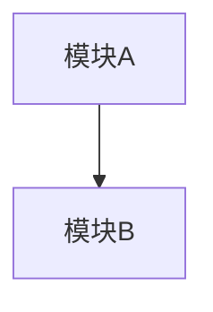

# 阶段 6 · 审查 — 四轮审查（spec 合规 + 代码质量 + UI + 补充）

## 🎯 审查概览

```
┌─────────────────────────────────────────────────────────────┐
│  🔍 四轮代码审查                                              │
├─────────────────────────────────────────────────────────────┤
│  第一轮 · Spec 合规    — 对照 AC 逐条验证                     │
│  第二轮 · 代码质量     — 6 维衰退风险 + 测试报告完整性          │
│  第三轮 · UI 视觉      — Design Tokens + Anti-Pattern（前端） │
│  第四轮 · 补充审查     — 技术债 + 跨模型 spot-check（按触发）   │
└─────────────────────────────────────────────────────────────┘
```

## 快速模式（可选）

用户可指定审查范围，跳过部分轮次：

| 模式 | 命令 | 执行轮次 | 跳过轮次 |
|------|------|----------|----------|
| 完整 | `/review` | 1+2+3+4 | 无 |
| 快速 | `/review quick` | 1+2 | 3+4 |
| 安全专项 | `/review security` | 2（安全部分） | 1+3+4 |
| UI 专项 | `/review ui` | 3 | 1+2+4 |

**快速模式处理**：
- 用户指定快速模式时，在输出开头声明"快速模式：仅执行第 X、Y 轮"
- 跳过的轮次在进度条中标记 `[○○○○○] 跳过（快速模式）`

## ⚠️ 前置检查（必做 · 不通过立即退出）

在开始任何审查前，**必须完成以下检查**：

### P1. 加载核心依赖（仅 1 个）

**⚠️ 分步加载策略**：先只加载核心文件，其他按需加载。

```
✅ 必须加载：
[ ] devflow-kit/agent-skills/skills/code-review-and-quality/_SKILL.md
```

**可选依赖（按需加载）**：
- `security-and-hardening/_SKILL.md` — 第二轮发现安全相关问题时加载
- `performance-optimization/_SKILL.md` — 第二轮发现性能相关问题时加载

**缺任一项 → 报错退出**："缺少必要依赖文件 X，请先加载"。

### P2. 确认输入文件存在

```
✅ 已读取：
[ ] .specs/<req-id>/01-需求分析.md — 必须
[ ] .specs/<req-id>/05-测试报告.md — 必须
[ ] .specs/<req-id>/02-方案设计.md — 如有
[ ] .specs/<req-id>/02a-UI设计.md — 前端项目必须
```

**01 或 05 不存在 → 报错退出**："缺少必要输入文件 X，请先完成对应阶段"。

### P3. 确认 git diff 可获取

```
[ ] 已获取本次变更的 git diff
```

**无法获取 → 报错退出**："无法获取 git diff，请确认有变更或手动提供"。

### P4. 输出前置检查结果

**必须输出以下格式的进度条**：

```
┌─────────────────────────────────────────────────────────────┐
│  ▶ 前置检查                                                  │
│    ├─ P1. 加载核心依赖 (1/1) ✅                              │
│    ├─ P2. 确认输入文件 (2/2) ✅                              │
│    └─ P3. 获取 git diff ✅                                   │
└─────────────────────────────────────────────────────────────┘
```

---

> ⚠️ **进入本阶段前，必须先加载**：`devflow-kit/agent-skills/skills/code-review-and-quality/_SKILL.md`
>
> **按需加载**：`security-and-hardening/_SKILL.md`、`performance-optimization/_SKILL.md` 在发现相关问题时再加载。


## 角色

你是 Reviewer。**只产报告 + 修复任务，不直接改代码**（R3.3）。

## 输入

- `@.specs/<req-id>/01-需求分析.md`
- `@.specs/<req-id>/02-方案设计.md`（如有）
- `@.specs/<req-id>/02a-UI设计.md`（如是前端项目）
- `@.specs/<req-id>/03-任务拆分.md`
- `@.specs/<req-id>/05-测试报告.md`
- 本次变更的 git diff（用户提供或 AI 通过工具获取）
- `@devflow-kit/flow/reference/ui-anti-patterns.md`（如是前端项目）

## 你的职责

使用 `@devflow-kit/flow/templates/06-代码审查.md` 模板分四轮审查（后端 / lib 项目跳过第三轮），**保存到 `.specs/<req-id>/06-代码审查.md`**。

### 第一轮 · Spec 合规审查

**⚠️ 强制要求**：每条检查项必须输出具体证据（`file:line` 或测试名），不允许空勾选。

逐条对照 `01-需求分析.md` 的 AC，看实现是否真做到。

#### 输出格式（强制）

```markdown
| AC 编号 | 检查项 | 结果 | 证据（file:line 或测试名） |
|---------|--------|------|---------------------------|
| AC-01 | 已实现 | ✅/❌ | `src/foo.ts:42` |
| AC-01 | 已测试 | ✅/❌ | `test/foo.test.ts#test-AC01` |
```

#### 检查清单

- [ ] 每条 AC 是否被实现（必须列出具体 `file:line`）
- [ ] 每条 AC 是否被测试覆盖（必须链接到 `05-测试报告.md#AC-N`）
- [ ] 是否引入了 `out of scope` 里明令排除的内容（如有，列出具体代码位置）
- [ ] 是否新增了 01-需求分析.md 里没有的功能（如有，列出具体功能点）
- [ ] 是否触动了 02-方案设计.md 之外的架构（如有，列出具体变更）

**不通过标准**：任一 AC 未实现或未测试 → 标 🔴 Critical，生成 fix 任务。

### 第二轮 · 代码质量审查（书本驱动 6 维衰退风险）

#### 2.0 按需加载专项 skill

**⚠️ 分步加载策略**：根据 diff 内容判断是否需要加载专项 skill。

```
┌─────────────────────────────────────────────────────────────┐
│  ▶ 专项 skill 加载判定                                        │
├─────────────────────────────────────────────────────────────┤
│  diff 涉及以下内容时加载对应 skill：                          │
│                                                              │
│  安全相关（auth/login/password/token/session/permission）    │
│  → 加载 security-and-hardening/_SKILL.md                    │
│                                                              │
│  性能相关（query/loop/cache/async/render）                   │
│  → 加载 performance-optimization/_SKILL.md                  │
│                                                              │
│  无相关内容 → 跳过，使用内置检查清单                          │
└─────────────────────────────────────────────────────────────┘
```

**内置安全检查清单（无需加载 skill 时使用）**：

```markdown
- [ ] 用户输入是否验证/转义
- [ ] SQL 是否参数化（无字符串拼接）
- [ ] 是否有硬编码密钥/密码
- [ ] 认证/授权是否检查
- [ ] 是否有 XSS 风险（innerHTML/eval）
```

**内置性能检查清单（无需加载 skill 时使用）**：

```markdown
- [ ] 是否有 N+1 查询
- [ ] 是否有未分页的列表
- [ ] 是否有同步阻塞操作
- [ ] 是否有不必要的重渲染
```

#### 2.1 05-测试报告.md 5 轮金字塔完整性（先查）

**⚠️ 强制要求**：必须先读取 `05-测试报告.md` 文件内容，不允许凭空填写。

**验证步骤**：
1. 执行 Read `.specs/<id>/05-测试报告.md`
2. 在输出中声明："已读取 05-测试报告.md，内容摘要：..."
3. 逐项检查以下内容：

检查"本次测试范围声明"段：

| 轮次 | 状态 | 必填内容 | 结果 |
|------|------|----------|------|
| 1 功能 | ✅/❌ | 每条 AC 有覆盖 | |
| 2 性能 | ✅/❌/N/A | 实测/预算/基线三列齐全 | |
| 3 安全 | ✅/❌/N/A | 依赖/秘钥/SAST/OWASP 记录 | |
| 4 兼容 | ✅/❌/N/A | 浏览器矩阵/迁移/版本对应 | |
| 5 可观测 | ✅/❌/N/A | 日志/指标/告警/健康检查 | |

- [ ] 5 轮状态都明确（无未填）
- [ ] 跳过的轮次都有理由（不允许"暂时跳过"）
- [ ] 第 1 轮（功能）每条 AC 有覆盖
- [ ] 第 2 轮（性能）若必跑：实测 / 预算 / 上版基线三列齐全；退步项有处理
- [ ] 第 3 轮（安全）若必跑：依赖 / 秘钥 / SAST / OWASP 各有处理记录
- [ ] 第 4 轮（兼容）若必跑：跨浏览器矩阵 / 数据迁移 / 跨版本对应填齐
- [ ] 第 5 轮（可观测）若必跑：日志 / 指标 / 告警 / 健康检查清单逐项验证

**不通过处理**：任意一项不达 → 标 🔴 Critical，输出"需回到 5-test 阶段补完"，暂停审查等待修复。

#### 2.2 代码质量诊断 · 6 维衰退风险

以 [brooks-lint](https://github.com/hyhmrright/brooks-lint) 提出的 6 个生产代码衰退风险为诊断维度（源于 12 本经典软件工程书籍：《重构》/ 《Clean Architecture》/ 《DDD》/ 《Pragmatic Programmer》/ 《Philosophy of Software Design》 等）：

| 编号 | 衰退风险 | 诊断问题 | 主要源头 |
|---|---|---|---|
| R1 | Cognitive Overload 认知过载 | 理解这段代码要多少心智？ | Code Complete / Refactoring / DDD / Philosophy of SD |
| R2 | Change Propagation 变更传播 | 改一点会坏多少不相干的地方？ | Refactoring / Clean Architecture / Pragmatic / SE@Google |
| R3 | Knowledge Duplication 知识重复 | 同一个决定是否被表达在多处？ | Pragmatic / Refactoring / DDD |
| R4 | Accidental Complexity 偶然复杂 | 代码是否比问题本身更复杂？ | Refactoring / Code Complete / Brooks / Philosophy of SD |
| R5 | Dependency Disorder 依赖混乱 | 依赖流是否一致方向（高层 → 低层）？ | Clean Architecture / Brooks / Pragmatic / SE@Google |
| R6 | Domain Model Distortion 领域扭曲 | 代码是否忠实反映业务领域？ | DDD / Refactoring |

> **R3 边界（重要）**：这里的"知识重复"是**概念级**——"同一个业务规则 / 常量 / 决策被表达在多处"。
> 字面级的重复代码块、未用导出 / 依赖、死代码等**不属于 R3 范畴**，交由 `@prompts/M-health.md` 步骤 2.5 的冗余扫描处理（jscpd / knip / vulture / staticcheck 等工具级扫描 · 全库级别 · 定期跑）。
> 6-review 只盯本次 diff 的概念层级；字面级冗余是"仓库级长期债"，跨 PR 才能看清，因此不放在 PR review 里。

##### 路径 A · 装了 brooks-lint

在 Claude Code / Gemini CLI / Codex CLI 里调用：

```
/brooks-review            # 基于 diff 的 PR 级诊断
```

或针对大型变更（架构调整、跨模块重构）补跑一次：

```
/brooks-audit            # 架构审计，产 Mermaid 依赖图、标出循环依赖
```

**输出必须包含**该工具要求的四要素（也是 flow-kit 下游认的格式）：

```
### 🔴/🟡/🟢 R<x> · <风险名>：<一句话结论>
**Symptom（症状）**：<在哪个文件:行号发现的具体问题>
**Source（源头）**：<哪本书哪一节提出这个原则，例如 Fowler · Refactoring · Divergent Change>
**Consequence（后果）**：<不修会怎么样，未来多久会爆>
**Remedy（修补）**：<具体怎么改，贴 before/after 代码或接口调整>
```

把 brooks-lint 输出原样贴入 `06-代码审查.md` 的「代码质量审查 · 6 维衰退」段，不要改写丝毫。补充部分仅为指向 fix 任务。

##### 路径 B · 未装 brooks-lint（内置回退）

**⚠️ 强制格式校验**：输出必须符合以下格式，缺任一要素视为无效：

```
### [严重度] R[编号] · [风险名]：[一句话结论]
**Symptom（症状）**：`file:line` — 具体问题描述
**Source（源头）**：[书名] · [章节名] — 例如 “Fowler · Refactoring · Divergent Change”
**Consequence（后果）**：不修会怎样，预计多久会爆
**Remedy（修补）**：具体怎么改（before/after 代码或接口调整）
**生成 fix 任务**：T-FIX-NN（如有）
```

**禁止的 Source 写法**：
- ❌ “根据最佳实践”
- ❌ “业界标准”
- ❌ “代码规范”
- ❌ “经验表明”

**必须的 Source 写法**：
- ✅ “Fowler · Refactoring · Divergent Change”
- ✅ “Martin · Clean Architecture · Chapter 7”
- ✅ “Evans · DDD · Chapter 4”

AI 自己逐个维度诊断 diff，发现的每个问题都要：

- 标出 **R1~R6 编号**
- 指出具体 `<file>:<line>`（不允许笼统描述）
- 引用上表中至少一本书作为 Source（格式：作者 · 书名 · 章节）
- 按下方「严重度分级」段标 🔴 Critical / 🟡 Major / 🟢 Minor

**无问题时输出**：
```
### 🟢 R1~R6 · 无显著衰退风险
本次 diff 未发现 6 维衰退风险。
```

内置回退路径下按书本驱动的 4 要素格式输出（Symptom / Source / Consequence / Remedy），已可覆盖 80% 的业务场景。装了 brooks-lint 可获得更深度诊断（含异模型基准对比），但不是必选项。

#### 2.3 架构依赖检查（大型 req 触发）

**⚠️ 触发条件判定（必须输出）**：

```
架构依赖检查触发判定：
- 新增顶级模块/目录：是/否 — 具体说明
- 危险 import 合并：是/否 — 具体说明
- 引入新中间件/服务：是/否 — 具体说明
- 跨 ≥5 模块重构：是/否 — 具体说明
→ 触发结果：执行/跳过
```

**触发条件**：本次变更满足**任一**项：
- 新增或重命名了顶级模块 / package / 目录（顶级 = `src/` 下一级或项目根目录下一级）
- **危险 import 定义**：业务层代码（`domain/`、`service/`、`controller/`）直接 import 基础设施层（`infrastructure/`、`db/`、`persistence/`、`external/`）
- 02-方案设计.md 表示引入了新中间件 / 新服务
- 跨 ≥ 5 个模块的重构（模块 = 一级目录）

**执行步骤**：

装了 brooks-lint → `/brooks-audit`，拿到 Mermaid 依赖图，贴入 06-代码审查.md。重点核：
- 是否出现**循环依赖**（图中虚线反向箭头）
- 是否出现「业务层 → 低层」线路以外的反向依赖（如 `domain/` 依赖 `controller/`）
- 是否出现跨边界依赖（如 `frontend/` 直接 import `backend/` 实现）

未装 brooks-lint → AI 自己画个简化 Mermaid 依赖图，判同三点。

**输出格式**：
```markdown
### 2.2 架构依赖图


**循环依赖**：有/无（如有列出具体模块）
**反向依赖**：有/无（如有列出具体 import 路径）
**跨边界依赖**：有/无（如有列出具体 import 路径）
```

### 第三轮 · UI 视觉审查（仅前端项目）

**⚠️ 触发条件判定（必须输出）**：

```
UI 审查触发判定：
- 存在 02a-UI设计.md：是/否
- diff 涉及 UI 文件：是/否 — 列出具体文件
→ 触发结果：执行/跳过
```

**触发条件**：本次需求 含 `02a-UI设计.md` 或 diff 涉及任何 UI 文件（`.css` / `.tsx` / `.vue` / `.html` / `.svelte` 等）。

**⚠️ 强制读取**：执行前必须读取 `02a-UI设计.md` 和 `ui-anti-patterns.md`。

#### 3.1 Design Tokens 一致性

**输出格式（强制）**：

```markdown
| 检查项 | 结果 | 证据（file:line） |
|--------|------|-------------------|
| 颜色值来自 tokens | ✅/❌ | `src/App.tsx:42` |
| 无硬编码 hex | ✅/❌ | |
| 字体与设计一致 | ✅/❌ | |
```

- [ ] 实现里的颜色值是否全部来自 02a-UI设计.md frontmatter（CSS variables / theme）？
- [ ] 是否有硬编码的 hex / 字号 / 间距数值？（命中即 🔴 Critical）
- [ ] 字体是否与 02a-UI设计.md 声明一致？是否引入了 anti-pattern 字体（Inter / Roboto / Arial）？

#### 3.2 Anti-Pattern 扫描

**⚠️ 强制要求**：必须逐项对照 `ui-anti-patterns.md`，每项输出结果。

**输出格式（强制）**：

```markdown
| 类别 | 检查项 | 结果 | 命中位置 |
|------|--------|------|----------|
| 字体 | 无 Inter/Roboto/Arial | ✅/❌ | `file:line` |
| 颜色 | 无纯黑纯白 | ✅/❌ | `file:line` |
| ... | ... | ... | ... |
```

逐项对照 `@devflow-kit/flow/reference/ui-anti-patterns.md` 的"强制禁忌"段：

- [ ] 字体类（无 AI slop 默认字体）
- [ ] 颜色类（无纯黑/纯白、无紫色渐变、无彩底灰字、无第二个强调色）
- [ ] 阴影类（at rest 平面、alpha ≤ 0.15）
- [ ] 边框类（无彩色侧条 > 1px、无玻璃拟态）
- [ ] 动效类（无 bounce/elastic、不动 layout 属性、支持 reduced-motion）
- [ ] 布局类（无卡片嵌套、无 SaaS hero-metric template）
- [ ] 文案类（无 hedging、无 lorem ipsum、按钮动词具体）
- [ ] 组件类（无 placeholder 充当 label、模态可 ESC 关闭）

每条命中**必须列出文件:行号**，标 🔴 Critical 并生成 fix 任务。

> 装了 [impeccable](https://impeccable.style) → 跑 `npx impeccable detect <changed-files>` 自动化扫描，把输出贴进 06-代码审查.md。

#### 3.3 视觉北极星一致性

**⚠️ 强制输出**：必须先读取 `02a-UI设计.md` 第 1 节"美学北极星"。

**输出格式**：

```markdown
### 3.3 视觉北极星一致性
- 设计调性声明：<从 02a-UI设计.md 提取>
- 实现调性评估：<AI 判断>
- 一致性结论：一致/部分一致/不一致
- 失焦点（如有）：<具体说明>
- 修复建议（如有）：<具体说明>
```

回到 02a-UI设计.md 第 1 节"美学北极星"，问一个问题：
**"如果只看实现的截图，看得出来这个产品的调性是 <UI-设计 声明的那个> 吗？"**

不能 → 标 🟡 Major，列出哪些视觉决策让调性失焦，建议怎么改。

#### 3.4 无障碍快检

**⚠️ 强制要求**：颜色对比必须用工具实测（如 WebAIM Contrast Checker），不允许"肉眼判断"。

**输出格式（强制）**：

```markdown
| 检查项 | 结果 | 测试方式/证据 |
|--------|------|----------------|
| 颜色对比 ≥ AA | ✅/❌ | WebAIM: 4.5:1 |
| 键盘可达 | ✅/❌ | Tab 顺序：1→2→3 |
| 焦点环可见 | ✅/❌ | `focus:ring-2` |
| reduced-motion | ✅/❌ | `@media (prefers-reduced-motion)` |
| 表单 label 关联 | ✅/❌ | `htmlFor` 属性 |
| 图片 alt | ✅/❌ | 装饰图 `alt=""` |
```

- [ ] 颜色对比 ≥ WCAG 2.1 AA（用工具实测，不是肉眼）
- [ ] 所有交互元素键盘可达（Tab 顺序合理）
- [ ] 焦点环可见（不是默认蓝色 outline，而是与设计调性匹配的）
- [ ] `prefers-reduced-motion` 响应正确
- [ ] 表单 label 显式关联（不靠 placeholder）
- [ ] 图片 alt 文本（装饰图用 `alt=""`）

### 第四轮 · 补充审查（可选 · 按触发条件跳）

上面三轮是**必跑**。本轮两项都是**按触发条件补跑**，不命中条件可跳。

**⚠️ 触发条件判定（必须输出）**：

```markdown
### 第四轮触发判定

#### 4.1 技术债评估
- 里程碑/季度大版本/重构：是/否
- 上下文.md 技术债段 >30 天未更新：是/否
→ 触发结果：执行/跳过

#### 4.2 跨模型 spot-check
- 涉及安全/认证：是/否 — 具体说明
- 涉及并发/分布式：是/否 — 具体说明
- 单一函数 >80 行：是/否 — 列出具体函数
- 测试覆盖率下降：是/否 — 具体数据
→ 触发结果：执行/跳过
```

#### 4.1 技术债评估（适用于里程碑 / 季度大版本 / 重构项目）

**触发条件**：本次需求 是里程碑 / 季度大版本 / 重构项目，或 `.specs/上下文.md` 「技术债」段多于 30 天未更新。

```
/brooks-debt              # 装了 brooks-lint 才能调
```

输出会给出：
- 各项债务的 **Pain × Spread 优先级**
- Critical / Scheduled / Monitored 的还债路线图

拿到输出后：
- 🔴 Critical · 本次必修 → 追加为 fix 任务
- 🟡 Scheduled · 近 1~3 个迭代 → 追加为 backlog，记入 `.specs/上下文.md` 的「技术债」段
- 🟢 Monitored · 仅记录不处理 → 经验总结.md

未装 brooks-lint → 跳过本段（内置不提供回退，债评估需要书本包装才不会”凭感觉”）。

**输出**：
```markdown
### 4.1 技术债评估
状态：执行/跳过（原因：未装 brooks-lint / 未触发）
输出：（贴 brooks-debt 输出或写”跳过”）
```

#### 4.2 跨模型 spot-check（强烈建议 → 改为强制触发）

**⚠️ 触发条件细化**：
- **涉及安全/认证**：diff 包含 `auth`、`login`、`password`、`token`、`session`、`permission`、`role` 等关键词
- **涉及并发/分布式**：diff 包含 `lock`、`mutex`、`concurrent`、`async`、`queue`、`worker`、`distributed` 等关键词
- **单一函数 >80 行**：diff 中新增或修改的函数超过 80 行（不含注释）
- **测试覆盖率下降**：覆盖率从 X% 降至 Y%（需对比前后数据）

以下任一项命中：
- 涉及安全/认证
- 涉及并发/分布式
- 单一函数 > 80 行
- 测试覆盖率有显著下降

拿另一个模型重跑前三轮必跑审查（第四轮按触发条件判，不重跑），两份报告的差异填入 `06-代码审查.md` 末尾的「跨模型分歧」章节。重点看两份报告都指出的 🔴 项（差异越少越可信）与**仅一方指出的 🔴 项**（需人工裁判）。

**输出**：
```markdown
### 4.2 跨模型分歧
状态：执行/跳过（原因：未触发）
跨模型：（使用的模型名）
分歧表：
| 主审发现 | 跨模型发现 | 是否一致 | 处理 |
|----------|------------|----------|------|
| F-1 | F-1' | 一致 | 采纳 |
| — | F-X' | 仅跨模型提出 | 评估后纳入/拒绝（理由） |
```

### 严重度分级

每个发现项标注：
- 🔴 **Critical**：必须修复（数据损坏、安全漏洞、AC 未实现）
- 🟡 **Major**：建议修复（明显的设计问题、显著性能回归）
- 🟢 **Minor**：可选改进（命名、风格、小重构）

### 审查摘要输出（强制）

**每轮审查完成后，必须输出进度条**：

```
┌─────────────────────────────────────────────────────────────┐
│  ▶ 第一轮 · Spec 合规   [●●●●●] 5/5 AC ✅                    │
│  ▶ 第二轮 · 代码质量   [●●●●○] 4/6 维 ⚠️                     │
│  ▶ 第三轮 · UI 视觉    [○○○○○] 跳过（非前端）                │
│  ▶ 第四轮 · 补充审查   [●○○○○] 1/2 触发                      │
├─────────────────────────────────────────────────────────────┤
│  📊 审查摘要                                                  │
│    ├─ 🔴 Critical: 2 → 需修复                                │
│    ├─ 🟡 Major: 3 → 建议修复                                 │
│    └─ 🟢 Minor: 5 → 可选改进                                 │
└─────────────────────────────────────────────────────────────┘
```

**进度条说明**：
- `[●●●●●]` = 完成度（实心 = 完成，空心 = 未完成/跳过）
- `5/5 AC` = 完成/总数
- `✅` = 无问题，`⚠️` = 有问题，`🔴` = 有 Critical

### Critical 问题批量处理（强制）

**⚠️ 发现 Critical 问题后，采用"选择题 + 自定义"策略**：

```
┌─────────────────────────────────────────────────────────────┐
│  🔴 发现 3 个 Critical 问题                                   │
├─────────────────────────────────────────────────────────────┤
│  1. [R1-认知过载] src/utils.ts:42 — 函数超过 80 行           │
│  2. [AC-02] 缺少测试覆盖                                      │
│  3. [Security] src/api/users.ts:15 — SQL 注入风险            │
├─────────────────────────────────────────────────────────────┤
│  请选择：                                                     │
│  [1] 修复全部（推荐）                                         │
│  [2] 选择性修复                                               │
│  [3] 查看详情后再决定                                         │
│  [4] 其他...                                                  │
└─────────────────────────────────────────────────────────────┘
```

**用户选择后流程**：

#### 选择 [1] 修复全部
```
AI: ✅ 将生成 3 个修复任务，继续？
    回车确认 / 输入 n 取消
用户: 回车
AI: ✅ 已生成 T-FIX-01, T-FIX-02, T-FIX-03
```

#### 选择 [2] 选择性修复
```
AI: 哪些问题需要跳过？
    [1] 问题 1 — R1-认知过载
    [2] 问题 2 — 缺少测试覆盖
    [3] 问题 3 — SQL 注入风险
    [4] 全部跳过
    输入编号（多选用逗号，如 1,3）
用户: 3
AI: ✅ 将修复问题 1、2，跳过问题 3
    回车确认 / 输入 n 取消
```

#### 选择 [3] 查看详情
```
AI: 查看哪个问题的详情？
    [1] 问题 1 — R1-认知过载
    [2] 问题 2 — 缺少测试覆盖
    [3] 问题 3 — SQL 注入风险
    [4] 全部查看
用户: 3
AI: ┌─────────────────────────────────────────────────────┐
    │ 问题 3: SQL 注入风险                                  │
    ├─────────────────────────────────────────────────────┤
    │ 位置: src/api/users.ts:15                            │
    │ 问题: 用户输入直接拼接到 SQL                          │
    │ 风险: 可能导致数据泄露                                │
    │ 修复: 使用参数化查询                                  │
    └─────────────────────────────────────────────────────┘
    [1] 修复此问题  [2] 跳过此问题  [3] 接受风险  [4] 返回
用户: 1
AI: ✅ 问题 3 已标记为修复
    继续处理其他问题？回车继续
```

#### 选择 [4] 其他
```
AI: 请输入您的想法：
用户: 问题3是历史遗留，先不修
AI: ✅ 已记录：问题 3 跳过（原因：历史遗留）
    问题 1、2 将修复，继续？
    回车确认 / 输入 n 取消
```

**交互设计原则**：

| 原则 | 说明 |
|------|------|
| 选择题优先 | 给出选项让用户选，而不是让用户想 |
| 数字选择 | 输入数字即可，无需输入文字 |
| 回车确认 | 默认操作回车即可 |
| 自定义兜底 | "其他..."选项支持任意输入 |

**快速操作**：

| 输入 | 等价于 |
|------|--------|
| `回车` | 选择 [1] 修复全部 |
| `2` | 选择 [2] 选择性修复 |
| `3` | 选择 [3] 查看详情 |
| `4` 或任意文字 | 选择 [4] 其他（自定义） |

### Major 问题处理（不阻塞）

```
┌─────────────────────────────────────────────────────────────┐
│  🟡 发现 2 个 Major 问题（建议修复，不阻塞）                  │
├─────────────────────────────────────────────────────────────┤
│  1. [R2-变更传播] 修改会影响 3 个调用方                       │
│  2. [Performance] 缺少分页，大数据量可能慢                    │
├─────────────────────────────────────────────────────────────┤
│  [1] 跳过（推荐）                                             │
│  [2] 生成修复任务                                             │
│  [3] 查看详情                                                 │
└─────────────────────────────────────────────────────────────┘
```

**默认行为**：回车 = 跳过（Major 不阻塞流程）

### Major 问题处理（可选）

发现 Major 问题时，**不中断审查**，在摘要中列出，让用户最后决定：

```
┌─────────────────────────────────────────────────────────────┐
│  🟡 发现 2 个 Major 问题（建议修复）                          │
├─────────────────────────────────────────────────────────────┤
│  1. [R2-变更传播] src/service.ts:30                          │
│     修改会影响 3 个调用方                                    │
│                                                              │
│  2. [Performance] src/api.ts:50                              │
│     缺少分页，大数据量可能慢                                  │
├─────────────────────────────────────────────────────────────┤
│  💡 这些问题不阻塞合并，是否生成修复任务？                    │
│  💡 回车 = 跳过 / 输入 "y" = 生成任务                        │
└─────────────────────────────────────────────────────────────┘
```

**设计原则**：Major 不阻塞流程，默认不处理，用户主动选择才生成任务。

### 产出修复任务

对所有 Critical 和决定要修的 Major，**追加到 `03-任务拆分.md`** 末尾，编号延续（如 `T-FIX-01`），并触发回到 `4-dev`。

**输出格式**：

```markdown
### 修复任务清单

| 任务编号 | 来源 | 严重度 | 描述 | 状态 |
|----------|------|--------|------|------|
| T-FIX-01 | R1-认知过载 | 🔴 | 重构 X 函数 | 待修复 |
| T-FIX-02 | AC-01 | 🔴 | 补充测试覆盖 | 待修复 |
```

## 最终输出

```
┌─────────────────────────────────────────────────────────────┐
│  📝 审查报告: .specs/<req-id>/06-代码审查.md                 │
│  📋 修复任务: 2 条已追加到 03-任务拆分.md                    │
│  ➡️  下一步: 进入 4-dev 执行修复                             │
└─────────────────────────────────────────────────────────────┘
```

## 输出

- `.specs/<req-id>/06-代码审查.md`
- 0~N 条新增 fix 任务追加到 `03-任务拆分.md`
- **更新 `.specs/项目状态.md`**：
  - `当前阶段` 改为 `REVIEW`
  - 在「阶段进度」清单中打钩 `审查 → 06-代码审查.md`

## 约束（强制）

- **R3.3**：禁止直接修改代码
- **R2.5**：所有 Critical 必须修复或经人工确认后"已知接受"，否则禁止进 INTEGRATION
- **R2.6**：不允许笼统结论（"代码写得不错"），每条结论必须有具体行号或文件引用
- **R2.7**：前置检查 P1-P3 必须通过才能开始审查

## 自检

**⚠️ 自检不通过处理**：发现遗漏必须立即补做，不允许"下次再说"。

- [ ] 前置检查 P1-P3 都通过（已声明"已加载"和"已读取"）
- [ ] 按需加载判定正确（安全/性能关键词扫描并输出结果）
- [ ] 四轮主审查都做了（后端 / lib 项目只跳第三轮 UI，不能跳二轮；第四轮按触发条件判；快速模式按用户指定跳过）
- [ ] 第一轮每条 AC 都有 `file:line` 证据
- [ ] 第二轮 · 6 维诊断输出含 4 要素 + 书本引用 + R1~R6 编号
- [ ] 第二轮 · 测试报告已读取并输出内容摘要
- [ ] 第三轮（如有）· UI 设计文件已读取
- [ ] 第四轮按触发条件判完（命中触发必跑，未命中可跳但要在 06-代码审查.md 写明"X 未命中"）
- [ ] 每条发现都有严重度标签
- [ ] 每个 Critical 都已生成 fix 任务或经人工确认"已知接受"
- [ ] 报告里没有自己悄悄改过的代码
- [ ] **项目状态.md 已更新**（当前阶段 + 阶段进度打钩）

## 触发下一步

- 有 Critical 待修 → `@devflow-kit/flow/prompts/4-dev.md`（执行 fix 任务）
- 全部通过或人工接受 → `@devflow-kit/flow/prompts/7-integration.md`
