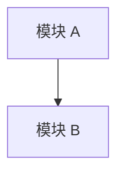

# 健康巡检 · <YYYY-MM-DD>

## 元信息

| 字段 | 值 |
|---|---|
| 巡检日期 | `<YYYY-MM-DD>` |
| 巡检模式 | `<brooks-health / brooks-sweep / 单维深挖 / 内置回退>` |
| 扫描范围 | `<仓库根 / 子项目 / 指定模块>` |
| 基准报告 | `<上次报告路径或无>` |
| 工具链 | `<brooks-lint / jscpd / knip / vulture / staticcheck / fallback>` |

## 综合分

- 当前：`<XX>/100`
- 上次：`<YY>/100`（`<YYYY-MM-DD>` 或 `无`）
- 趋势：`<↑ / ↓ / →>` `<变化值>`
- 结论：`<一句话说明整体健康变化>`

## 6 维生产代码风险

> 装了 brooks-lint 时贴原始输出；未装时标明“内置回退评分”。

| 维度 | 状态 | 关键证据 | 建议 |
|---|---|---|---|
| R1 Cognitive Overload | `<🔴/🟡/🟢>` | `<file:line 或工具输出摘要>` | `<处理建议>` |
| R2 Change Propagation | `<🔴/🟡/🟢>` | `<file:line 或工具输出摘要>` | `<处理建议>` |
| R3 Knowledge Duplication | `<🔴/🟡/🟢>` | `<file:line 或工具输出摘要>` | `<处理建议>` |
| R4 Accidental Complexity | `<🔴/🟡/🟢>` | `<file:line 或工具输出摘要>` | `<处理建议>` |
| R5 Dependency Disorder | `<🔴/🟡/🟢>` | `<file:line 或工具输出摘要>` | `<处理建议>` |
| R6 Domain Model Distortion | `<🔴/🟡/🟢>` | `<file:line 或工具输出摘要>` | `<处理建议>` |

## 6 维测试代码风险

| 维度 | 状态 | 关键证据 | 建议 |
|---|---|---|---|
| T1 AC Coverage | `<🔴/🟡/🟢>` | `<测试报告 / 覆盖证据>` | `<处理建议>` |
| T2 Behavior Focus | `<🔴/🟡/🟢>` | `<test file:line>` | `<处理建议>` |
| T3 Determinism | `<🔴/🟡/🟢>` | `<test file:line>` | `<处理建议>` |
| T4 Boundary Coverage | `<🔴/🟡/🟢>` | `<test file:line>` | `<处理建议>` |
| T5 Integration Realism | `<🔴/🟡/🟢>` | `<test file:line>` | `<处理建议>` |
| T6 Maintainability | `<🔴/🟡/🟢>` | `<test file:line>` | `<处理建议>` |

## 架构图

- 循环依赖：`<无 / 列表>`
- 反向依赖：`<无 / 列表>`
- 跨边界依赖：`<无 / 列表>`

## 冗余巡检

**工具**：`<jscpd + knip / vulture / staticcheck / fallback>`

| 维度 | 🔴 Critical | 🟡 Major | 🟢 Minor | 元数据 |
|---|---:|---:|---:|---|
| 字面重复块 | `<N>` | `<N>` | `<N>` | `<总重复率 X.X%>` |
| 未用导出 | `<N>` | `<N>` | `<N>` | `<X 条 / 总导出 Y>` |
| 未用依赖 | `<N>` | `<N>` | `<N>` | `<X / Y 顶层依赖>` |
| 死代码 / 孤立文件 | `<N>` | `<N>` | `<N>` | `<说明>` |

### 发现清单

| 严重度 | 位置 | 问题 | 建议处理 |
|---|---|---|---|
| `<🔴/🟡/🟢>` | `<file:line>` | `<问题描述>` | `<修复 / 记录 / 忽略理由>` |

## 技术债优先级

| 债项 | Pain | Spread | 优先级 | 建议 | 去向 |
|---|---:|---:|---|---|---|
| `<问题>` | `<1-5>` | `<1-5>` | `<Critical / Scheduled / Monitored>` | `<处理建议>` | `<health-fix / 上下文.md / 经验总结.md>` |

## 行动建议

- 🔴 Critical · 本月内修：`<列表或无>`
- 🟡 Scheduled · 本季度修：`<列表或无>`
- 🟢 Monitored · 仅记录：`<列表或无>`

## 与上次对比

- 已改善：`<列表或无>`
- 新增退化：`<列表或无>`
- 持平：`<列表或无>`

## 反哺记录

| 去向 | 内容 | 状态 |
|---|---|---|
| `.devflow-kit/上下文.md` | `<技术债 / 禁动清单追加>` | `<已写 / 待确认 / N/A>` |
| `.devflow-kit/经验总结.md` | `<观察条目>` | `<已写 / 待确认 / N/A>` |
| `health-fix` req | `<Critical 汇总>` | `<已创建 / 待用户确认 / N/A>` |

## 下次巡检建议

- 建议时间：`<YYYY-MM-DD>`
- 触发条件：`<新增大模块 / 发布前 / 技术债处理后 / 一个月后>`
